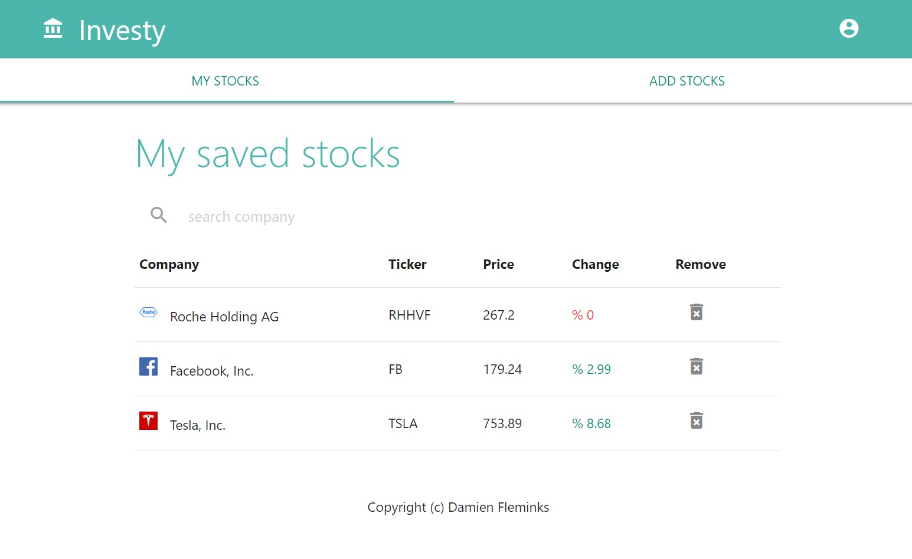

# Investy - React Ruby on Rails app


Ruby on Rails React app to save your favorite stocks.




### Ruby version
- Developed in ruby 2.3.3p222


### Configuration
- Run 'bundle install' to install dependencies
- API key for stock_quote is set in StockPresenter Class referenced in ./app/presenters/StockPresenter.rb

### Database creation
- run "rake db:migrate" to intialise database


### Deployment instructions
 - Deployed on Heroku
 - To deploy on production, set the hostname and port in './config/environments/production.rb'

 ````
  config.action_mailer.default_url_options = { host: 'investy-demo.herokuapp.com' }
 ````

 Demo:
https://investy-demo.herokuapp.com/
